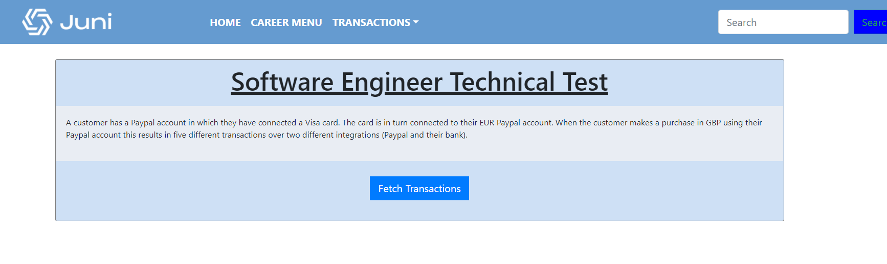
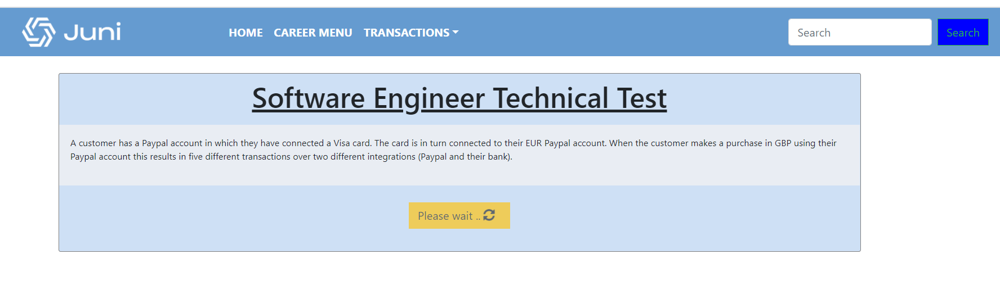
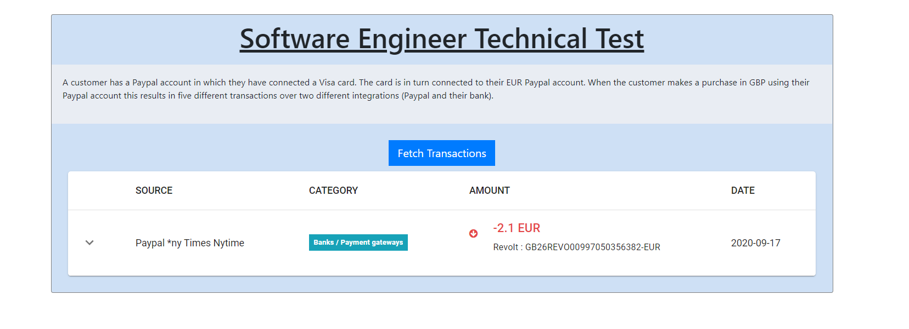
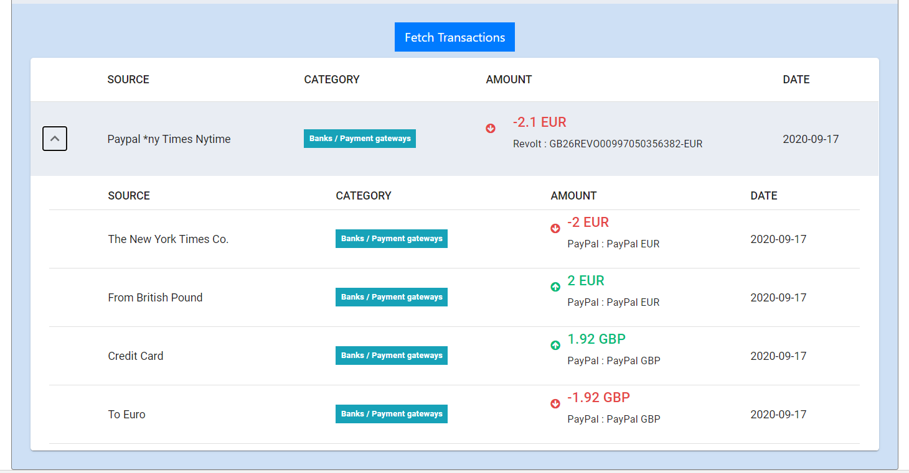

#### This project is developed using ####
- React.js for client side
- Node & Expressjs for server side

#### How to run it ####
- switch to the root folder of the project.
- run `npm install`
- run `npm run installClientDeps` after the above command is successfully executed.
- run `npm run execute`
- navigate to `http://localhost:3000/`
- click on `Fetch Transactions` button

**The last command runs both the client as well as the node servers**
**The client side runs on port 3000, the server side runs on port 4000**

#### Project components [Client Side] ####
This project consists of couple of client side components that can be found under /client/src/components
each and every component is a self explainotary, i.e: Navs, home, table ...etc, the core component is the `transactions.tsx` component which uses the class `backend.ts` and communicates with the node server via **NodeServer.executeCall()** to get the transactions, it also uses an inner component named `CollapsibleTable` and passes down the transactions response which is posted back by the node server.

The `CollapsibleTable` loops through the incoming payload and renders the datatable, i.e : each bank transaction with its linked paypal transactions.

#### Project components [Server Side] ####
The server is written using node and express, the core file is `transactionsReader.js` it invokes two main functions `one to read all bank transactions named "readBankTransactions => Array(Transactions)" and other to read all paypal transactions named "readPaypalTransactions() => Array(Transactions)" assuming that bank trans. are saved in db and paypall trans. also saved in a separate table in db i.e : Mongodb, Mariadb, MySql,.... etc`;

## All JSON files for bank and Paypal are placed in ./transactionsRepo/ [banks]/[paypals]

#### The core Algorithm in the server side ####
- After reading the banks transactions, say we have one transactions, we get the timestamp in which this transaction was done.
- Read all paypall transactions from paypal table where `the paypal transaction took place immediately after the bank transaction`
- Segregate them baised on currency type [Our bank transaction currency and paypal online shopping currency].
- If there're multiple paypal trans. then sort them by the creation id `[since the id is auto generated and incremented this will allow us to identify which record is created first]`.
- Merge them all and link/attached to the main `bank transaction records`, this means
   - # Parent Bank Transaction (PBT)
         - # Children/Child paypal transaction(s) (PPTS)
   - # { PBT , linkedPaypals : Array(PPTS) }
- The core alogirthm return the below response format
- #### Array({ PBT , linkedPaypals : Array(PPTS) })

### A timeout of 4secs is assigned to the API request handler in the server side.

-- File ends

**Amine Mahamat**